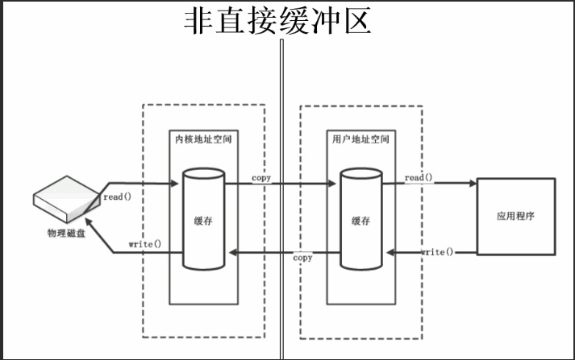
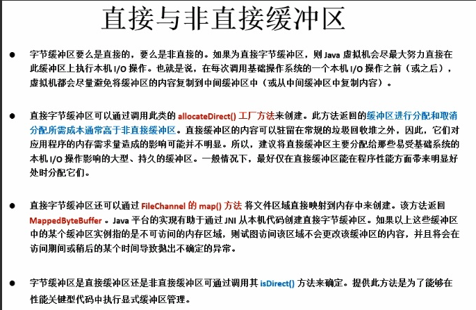
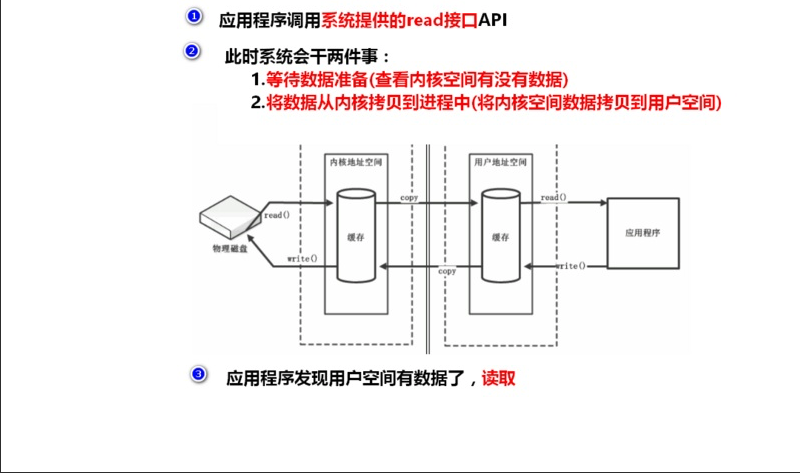
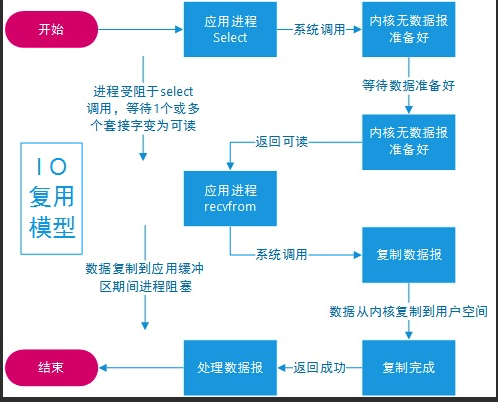
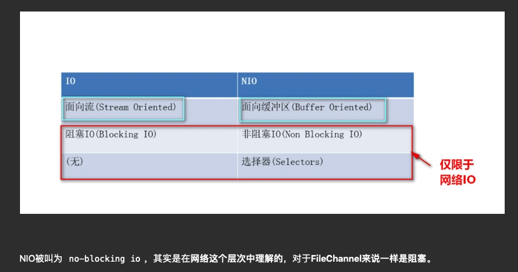

### 通道Channel
- 通道Channel，用于源节点和目标节点的连接。在java nio中负责缓冲区中数据的传输。
- Channel本身不存储数据，操作数据都是通过Buffer缓冲区来进行操作！

### channel的主要实现类
Java.nio.channels.Channel接口：
* FileChannel
* SocketChannel
* ServerSocketChannel
* DatagramChannel 数据包

### 获取channel
* JAVA 针对支持channel的类提供类getChannel()方法
     * 本地IO
        * FileInputStream/FileOutputStream
        * RandomAccessFile
            * ??? 三个类的区别
    * 网络IO
        * Socket
        * ServerSocket
        * DatagramSocket
            * ServerSocket Socket的职责分工，DatagramSocket的应用场景
            
* 在JDK 1.7中 NIO.2 针对各个channel提供了静态方法open()
* 在JDK 1.7中 NIO.2 Files工具类的newByteChannel()

### 直接与非直接缓冲区
* FileChannleDemo：使用FileChannel配合缓冲区实现文件复制功能
* FileChannleDemo：使用内存映射文件的方式实现文件复制的功能(直接操作缓冲区)
* FileChannleDemo：通道之间通过transfer() 实现数据的传输(直接操作缓冲区)

* 非直接缓冲区是需要经过一个： copy的阶段，从内核空间copy到用户空间
* 直接缓冲区不需要经过copy阶段，也可以理解成--->内存映射文件





### I/O模型基础

* Linux 的内核将所有外部设备都看做一个文件来操作，对一个文件的读写操作会调用内核提供的系统命令(api)，返回一个file descriptor（fd，文件描述符）。
而对一个socket的读写也会有相应的描述符，称为socket fd（socket文件描述符），描述符就是一个数字，指向内核中的一个结构体（文件路径，数据区等一些属性）。

* 为了保证用户进程不能直接操作内核（kernel），保证内核的安全，操心系统将虚拟空间划分为两部分
	* 内核空间
	* 用户空间
* I/O运行过程（以read为例）



* 调用select/poll/epoll/pselect其中一个函数，传入多个文件描述符，如果有一个文件描述符就绪，则返回，否则阻塞直到超时。
比如poll()函数是这样子的：int poll(struct pollfd *fds,nfds_t nfds, int timeout);

```
其中 pollfd 结构定义如下：
struct pollfd {
    int fd;         /* 文件描述符 */
    short events;         /* 等待的事件 */
    short revents;       /* 实际发生了的事件 */
};
```



* 1、当用户进程调用了select，那么整个进程会被block；

* 2、而同时，kernel会“监视”所有select负责的socket；

* 3、当任何一个socket中的数据准备好了，select就会返回；

* 4、这个时候用户进程再调用read操作，将数据从kernel拷贝到用户进程(空间)。

所以，I/O 多路复用的特点是通过一种机制一个进程能同时等待多个文件描述符，而这些文件描述符其中的任意一个进入读就绪状态，select()函数就可以返回。
select/epoll的优势并不是对于单个连接能处理得更快，而是在于能处理更多的连接。



### 使用NIO完成网络通信的三个核心
* 通道channel：负责连接
	* java.nio.channels.channel接口
		* SelectableChannel
			* SocketChannel
			* ServerSocketChannel
			* DatagramChannel
			* ---------------------------------
			* Pipe.SinkChannel
			* Pipe.SourceChannel
* 缓冲区Buffer：负责数据存取
* 选择器Selector：是SelectableChannel的多路复用器。用于监控SelectableChannel的IO状况


